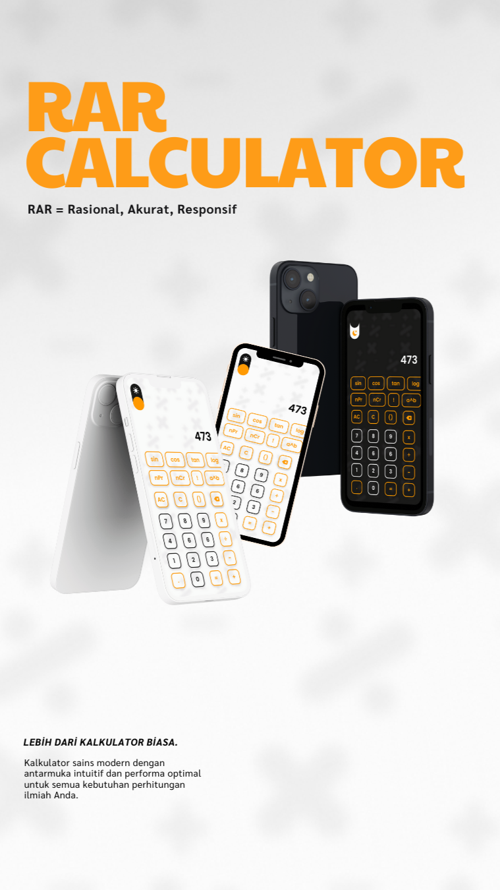

# 🧮 RAR Calculator - Kalkulator Sains Modern

Landing page resmi untuk aplikasi **RAR Calculator**, sebuah kalkulator sains modern dengan antarmuka intuitif, mode terang & gelap, dan berbagai fitur canggih seperti fungsi trigonometri, logaritma, statistik, hingga riwayat kalkulasi.

---

## 📌 Fitur Website

- Responsive design, cocok untuk mobile & desktop
- Navigasi halus antar section (smooth scroll)
- Galeri mockup aplikasi (dark & light mode)
- Perbandingan fitur antar kalkulator
- Testimoni pengguna
- FAQ interaktif
- Tombol download APK (dengan QR code)
- Popup modal untuk kebijakan privasi, ketentuan layanan, kontak, dan masukan
- Dukungan **Dark Mode** toggle

---

## 💻 Teknologi yang Digunakan

| Teknologi        | Deskripsi                                                  |
| ---------------- | ---------------------------------------------------------- |
| **HTML5**        | Struktur halaman web                                       |
| **Tailwind CSS** | Utility-first CSS framework untuk styling cepat dan modern |
| **JavaScript**   | Interaksi seperti smooth scroll, dark mode, modal, dll     |
| **Font Awesome** | Library ikon berbasis CSS                                  |

---

## 📁 Struktur Folder

rarc-landingpage/
├── index.html
├── css/
│ └── style.css
├── js/
│ └── script.js
├── img/
│ ├── logo.png
│ ├── light.png
│ ├── dark.png
│ ├── mockupbanner.png
│ ├── theme.png
│ └── qrcodedownload.png

## 📷 Preview

---

## 📦 Credits

- Logo & mockup by [Ridzkal Jamil](https://github.com/ridzkaljamil)
- Font: [Poppins](https://fonts.google.com/specimen/Poppins)
- Icons: [Font Awesome](https://fontawesome.com/)
